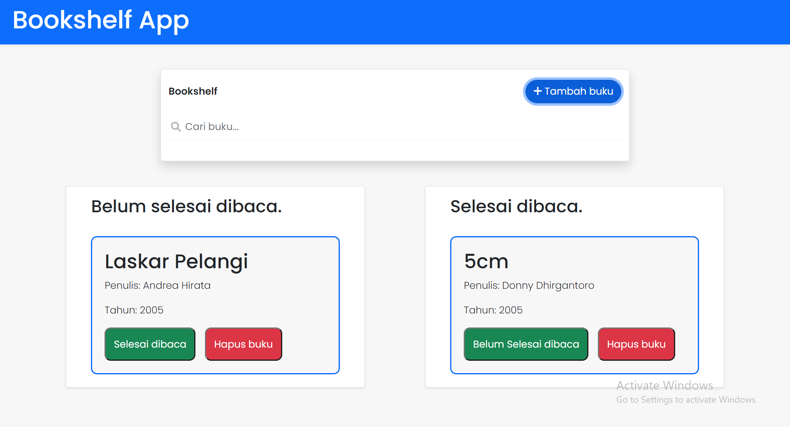

# Bookshelf App

## Table of contents

- [Overview](#overview)
  - [About the project](#the-challenge)
  - [Screenshot](#screenshot)
  - [Links](#links)
- [My process](#my-process)
  - [Built with](#built-with)

### About the project

This project is intended to train my Javascript skills:

- Use DOM and BOM to manipulate the browser nor HTML document
- Create event based on user activities
- Manage browser memory

### Screenshot

### Links

- Live Site URL: [Add live site URL here](https://your-live-site-url.com)

### Built with

- Semantic HTML5 markup
- CSS3 custom properties
- Vanilla Javascript
- Flexbox
- Mobile-first workflow
